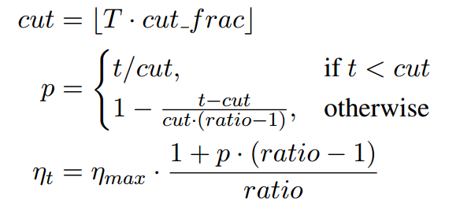
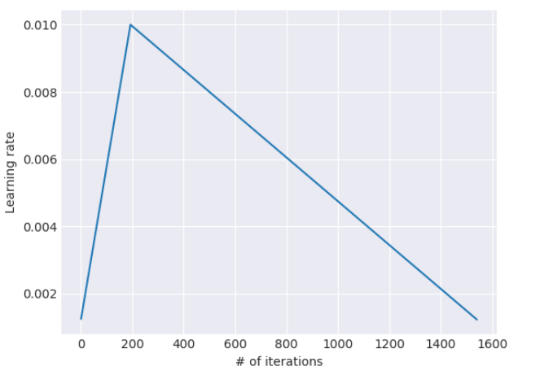

# reading《Universal Language Model Fine-tuning for Text Classification》

## Contributions 

- model：achieve CV-like transfer learning
- skill：`discriminative fine-tuning` `slanted triangular learning rates` `gradual unfreezing` 
- performance： 6 text-classification task，18%-24% error reduction
- sample-efficient,  ablation analysis ??
- pretrained model, code available

## Related work

### transfer learning in CV

fine-tune first layer of general model  ==>  fine-tune several of the last layers

### hyper columns ??

recently go beyond transferring word embedding

embedding as feature

in CV , hyper columns  ==> end-to-end fine-tune

### multi-task learning 

trained from scratch 

### fine-tuning

 success in similar task, failed in unrelated ones

## Universal Language Model Fine-tuning 

- transfer learning for NLP

  for source task, target task, improve performance  target task

- language modeling in NLP   =  ImageNet in CV

  captures: `long-term dependencies ` `hierarchical relations` `sentiment `

- universal means

  - work across task
  - single architecture and training
    process 
  - no custom feature engineering or preprocessing needed
  - no additional in-domain documents or labels  required

- steps

  - a) General-domain LM pretraining 
  - b) target task LM fine-tuning 
  - c) target task classifier fine-tuning

### General-domain LM pretraining

trained on Wikitext-103 

### target task LM fine-tuning 

#### Discriminative fine-tuning 

`idea`    different layer different info  ==> different extents fine-tune  ==> different  learning rate for each layers

`method`   
$$
\theta^l_t = \theta^l_{t-1} - \eta^l\triangledown_{\theta^l} J(\theta)
$$

$$
\eta^{l-1} = \eta^l/2.6
$$

#### Slanted triangular learning rates 

`idea`  quickly converge to a suitable region of parameter space

linearly increase then decays according to update schedule

`method` 

> T   number of total iterations
>
> cut_frac    fraction of iteration we increase lr
>
> ratio  how much smaller the lowest lr is from the maximum lr
>
> general cut_frac=0.1   ration=32 nmax = 0.01

### Target task classifier fine-tuning 

- add 2 linear blocks
- \+ batch normalization \+ dropout
- with ReLU with softmax

#### concat poling

**signal** in text classification tasks is often **contained in a few words**, occur

**anywhere**  ==>  
$$
H = \{h_1,...h_T\}\\
h_c = [h_T, maxpool(H),meanpool(H)]
$$

#### gradual unfreezing 

gradually unfreeze the model starting from the **last layer** as this contains the **least general knowledge**

first unfreeze the last layer and fine-tune all unfrozen layers for one epoch. We then unfreeze the next lower frozen layer and repeat 

#### BPTT for Text Classification (BPT3C) 

divide the document into fixed-length batches of size b 

#### Bidirectional language model 

we pretrain both a forward and a backward LM. We fine-tune a classifier for each LM independently using BPT3C and average the classifier predictions